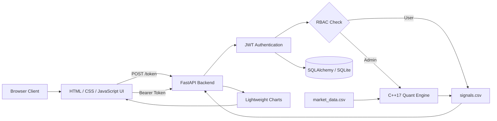

<div align="center">

# Secure Quant Dashboard

### C++ Quant Engine · FastAPI · JWT Authentication · Role-Based Access Control

A secure full-stack algorithmic trading dashboard that calculates moving-average crossover signals with a native C++ engine and presents the results through an authenticated web interface.

<br>

[](https://secure-quant-dashboard.onrender.com)
[](#)
[](#)
[](#)
[](https://secure-quant-dashboard.onrender.com)

</div>

---

## English

### Overview

Secure Quant Dashboard is a full-stack finance application that combines:

- A native **C++17 quantitative calculation engine**
- A **FastAPI** backend
- **JWT-based authentication**
- **Role-Based Access Control — RBAC**
- **SQLAlchemy** user persistence
- An interactive financial chart powered by **Lightweight Charts**
- Automated cloud deployment through **Render**

The application reads historical market prices, calculates SMA20 and SMA50 values, detects bullish and bearish crossovers, and displays the generated BUY/SELL signals on an interactive chart.

> The live dashboard is authentication-protected. Credentials are configured securely through environment variables and are not published in this repository.

### Live Application

**Production:**  
https://secure-quant-dashboard.onrender.com

**Health endpoint:**  
https://secure-quant-dashboard.onrender.com/health

**API documentation:**  
https://secure-quant-dashboard.onrender.com/docs

---

## Core Features

### Native C++ Quant Engine

The financial calculation layer is implemented in C++17.

It:

- Reads closing-price data from `data/market_data.csv`
- Calculates 20-period and 50-period Simple Moving Averages
- Detects SMA crossover events
- Generates BUY, SELL and HOLD signals
- Writes results to `data/signals.csv`
- Uses rolling sums to complete the calculations in linear time
- Writes to a temporary file before atomically publishing the final output

### Secure Authentication

- Passwords are hashed using **bcrypt**
- Successful login creates a signed **JWT access token**
- Tokens include username and role information
- Token expiration is configurable
- Secret keys and credentials are read from environment variables
- No production passwords are stored in the repository

### Role-Based Access Control

| Role | Permissions |
|---|---|
| `admin` | Reads dashboard data and executes the C++ calculation engine |
| `user` | Reads the most recently generated calculation results |
| unauthenticated | Can access only the login page and health endpoint |

### Interactive Dashboard

The frontend displays:

- Historical closing prices
- SMA20 series
- SMA50 series
- BUY markers
- SELL markers
- Current user role
- Authentication and session state

---

## System Architecture



### Request Flow

```text
Browser
   │
   ├── POST /token
   │      └── Username + password verification
   │             └── Signed JWT access token
   │
   └── GET /api/data
          └── Bearer token validation
                 └── Role check
                        ├── ADMIN → Execute C++ engine
                        └── USER  → Read existing output
                                      │
                                      └── Return JSON market data
```

---

## Quantitative Strategy

The application uses a Simple Moving Average crossover strategy.

For an `n`-period moving average:

```text
SMA(n, t) = [P(t) + P(t-1) + ... + P(t-n+1)] / n
```

Where:

- `P(t)` is the closing price at time `t`
- `SMA20` represents the short-term trend
- `SMA50` represents the longer-term trend

### Signal Rules

```text
BUY  → SMA20 crosses above SMA50
SELL → SMA20 crosses below SMA50
HOLD → No crossover
```

Signal values written by the engine:

| Value | Meaning |
|---:|---|
| `1` | BUY |
| `-1` | SELL |
| `0` | HOLD |

### Time Complexity

The C++ engine uses rolling sums rather than recalculating every moving-average window from scratch.

```text
Time complexity:  O(n)
Memory complexity: O(n)
```

---

## API Endpoints

| Method | Endpoint | Authentication | Description |
|---|---|---|---|
| `GET` | `/` | No | Login page and web dashboard |
| `POST` | `/token` | Username/password | Creates a JWT access token |
| `GET` | `/api/data` | Bearer token | Returns calculated market data |
| `GET` | `/health` | No | Reports application and engine status |
| `GET` | `/docs` | No | Interactive OpenAPI documentation |

Example health response:

```json
{
  "status": "ok",
  "engine_exists": true,
  "signals_exists": true
}
```

---

## Technology Stack

### Backend

- Python
- FastAPI
- Uvicorn
- Pandas
- SQLAlchemy
- python-jose
- bcrypt

### Quantitative Engine

- C++17
- Standard Template Library
- Filesystem API
- Rolling-window calculations
- CSV input/output pipeline

### Frontend

- HTML5
- CSS3
- Vanilla JavaScript
- TradingView Lightweight Charts

### Infrastructure

- Render Web Service
- Render Blueprint
- Environment-based secrets
- Automated Linux C++ compilation
- GitHub-based deployment

---

## Project Structure

```text
finans_projesi/
├── data/
│   ├── market_data.csv       # Historical market input
│   └── signals.csv           # Generated calculation output
│
├── src/
│   ├── api.py                # FastAPI, JWT, RBAC and frontend
│   ├── database.py           # SQLAlchemy database configuration
│   ├── add_user.py           # Secure CLI user creation
│   └── engine.cpp            # Native C++ quantitative engine
│
├── .env.example              # Environment variable template
├── .python-version           # Python runtime version
├── build.sh                  # Dependency installation and C++ build
├── render.yaml               # Render Blueprint configuration
├── requirements.txt          # Python dependencies
└── README.md
```

---

## Local Installation

### Prerequisites

- Python 3.14 or a compatible Python 3 release
- `g++` or `clang++` with C++17 support
- Git

### Clone the Repository

```bash
git clone https://github.com/aybukegozler/finans_projesi.git
cd finans_projesi
```

### Create a Virtual Environment

macOS or Linux:

```bash
python3 -m venv finans_env
source finans_env/bin/activate
```

### Configure Environment Variables

```bash
cp .env.example .env
```

Set secure values in `.env`:

```env
SECRET_KEY=generate-a-long-random-secret
ACCESS_TOKEN_EXPIRE_MINUTES=60

ADMIN_USERNAME=your_admin_username
ADMIN_PASSWORD=your_strong_admin_password

USER_USERNAME=your_user_username
USER_PASSWORD=your_strong_user_password
```

Never commit the real `.env` file.

### Build the Project

```bash
chmod +x build.sh
./build.sh
```

The build script:

1. Installs Python dependencies
2. Detects `g++` or `clang++`
3. Compiles `src/engine.cpp`
4. Runs the C++ engine
5. Validates the generated signal file

### Start the Application

```bash
set -a
source .env
set +a

uvicorn src.api:app \
  --host 127.0.0.1 \
  --port 8000 \
  --reload
```

Open:

```text
http://127.0.0.1:8000
```

---

## Deployment

Deployment is configured through `render.yaml`.

During each Render build:

```text
Install Python dependencies
          ↓
Compile the C++17 engine on Linux
          ↓
Generate signals.csv
          ↓
Start FastAPI with Uvicorn
          ↓
Run /health checks
```

Render start command:

```bash
uvicorn src.api:app --host 0.0.0.0 --port $PORT
```

Production credentials are managed through Render environment variables.

---

## Security Notes

Current protections:

- bcrypt password hashing
- Signed JWT access tokens
- Token expiration
- Role-based authorization
- Environment-based credentials
- No committed production secrets
- C++ subprocess timeout
- Explicit subprocess error handling

Recommended future production hardening:

- Store tokens in Secure, HttpOnly cookies instead of browser local storage
- Add login rate limiting
- Use a persistent PostgreSQL database
- Add refresh-token rotation
- Add audit logging
- Configure security headers
- Add automated dependency and secret scanning

---

## Limitations

- The current strategy is based only on SMA20/SMA50 crossovers.
- It does not include transaction fees, slippage or position sizing.
- The included market dataset is static.
- SQLite is used by default.
- The dashboard is a technical demonstration, not a brokerage platform.
- The strategy output must not be treated as financial advice.

---

## Roadmap

- [ ] Dynamic symbol and date-range selection
- [ ] Live market-data ingestion
- [ ] Strategy backtesting module
- [ ] Profit/loss and risk metrics
- [ ] PostgreSQL production database
- [ ] Secure HttpOnly cookie authentication
- [ ] Automated test suite
- [ ] GitHub Actions CI pipeline
- [ ] Docker support
- [ ] Admin audit records

---

## Türkçe

### Proje Hakkında

Secure Quant Dashboard; C++ ile geliştirilen finansal hesaplama motorunu, FastAPI backend sistemini, JWT tabanlı kimlik doğrulamayı ve rol tabanlı yetkilendirmeyi tek bir projede birleştiren güvenli bir algoritmik ticaret panelidir.

Sistem geçmiş kapanış fiyatlarını okuyarak:

- SMA20 hesaplar
- SMA50 hesaplar
- Hareketli ortalama kesişimlerini tespit eder
- AL, SAT ve BEKLE sinyalleri üretir
- Sonuçları etkileşimli web grafiğinde gösterir

### Rol Sistemi

| Rol | Yetki |
|---|---|
| `admin` | C++ motorunu yeniden çalıştırabilir ve sonuçları görüntüleyebilir |
| `user` | Daha önce hesaplanmış sonuçları görüntüleyebilir |
| giriş yapmamış kullanıcı | Yalnızca giriş sayfasına ve sağlık kontrolüne erişebilir |

### Güvenlik

- Şifreler bcrypt ile hashlenir.
- Giriş yapan kullanıcıya süreli JWT token verilir.
- Token içinde kullanıcı ve rol bilgisi bulunur.
- Gizli anahtarlar ve şifreler environment variable olarak tutulur.
- Gerçek `.env` dosyası GitHub'a gönderilmez.
- C++ motoru yalnızca admin rolü tarafından tetiklenir.

### C++ Hesaplama Motoru

C++ motoru `market_data.csv` dosyasını okur ve kayan toplam yöntemiyle SMA20 ve SMA50 değerlerini `O(n)` zamanda hesaplar.

Kısa dönem ortalama uzun dönem ortalamayı yukarı keserse **AL**, aşağı keserse **SAT** sinyali oluşturulur.

Sonuçlar:

```text
data/signals.csv
```

dosyasına yazılır ve FastAPI tarafından JSON formatına dönüştürülerek arayüze gönderilir.

---

## Disclaimer

This project is intended for software engineering and quantitative-finance education.

It does not provide investment advice, trade execution or guaranteed financial returns.

Bu proje yazılım mühendisliği ve nicel finans eğitimi amacıyla hazırlanmıştır. Yatırım tavsiyesi değildir.

---

## Author

**Aybüke Gözler**

GitHub: [@aybukegozler](https://github.com/aybukegozler)

